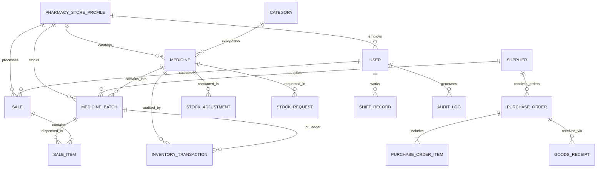

# Architecture Specification: Modular Independent Subsystems & Comprehensive Database Schema

**Date**: October 8, 2026  
**Status**: APPROVED DESIGN  
**Target Repository**: `athronos21/Internship-DDSS`

---

## 1. Executive Summary & Goals

This specification details the end-to-end architectural redesign of the Kaziniya Drug Store & Digital Dispensary platform into decoupled, independently maintained subsystems. Every part of the system—from the database access layer and backend domain routers to frontend API client services and operational workstations—is designed with clear boundaries and strong contracts so any part can be updated, extended, or replaced in the future without causing ripple effects or breaking other modules.

### Core Objectives
1. **Comprehensive Database Schema**: Formalize every property, relationship, and constraint across all 14 domain entities (Medicine, Batch, Transaction, Sale, PO, Supplier, Audit, HR, Node, etc.).
2. **Repository Pattern (Data Access Layer)**: Modularize `src/server/db.ts` into isolated domain repositories under `src/server/db/repositories/`, providing transaction safety and preparing the app for seamless future migration to PostgreSQL or SQLite.
3. **Modular Domain Routers**: Decompose the 2,135-line monolithic `server.ts` into individual, self-contained routers under `src/server/routes/`.
4. **Typed Client API Layer**: Provide dedicated frontend services under `src/services/api/` so UI components never make raw, untyped HTTP calls.
5. **Decoupled Workstations**: Ensure each operational workstation (IMS, POS, Purchasing, Finance, Master Admin) operates independently with clear entry points and isolated local state.
6. **100% Backward Compatibility**: Guarantee all 138 existing tests and browser workflows continue to pass without regression.

---

## 2. Comprehensive Database Schema & Property Catalog

The database layer maintains strict relational integrity, data normalization, and audit trails.



### 2.1 Entity: `PharmacyStoreProfile` / `RegisteredPharmacyNode`
Represents the licensed drugstore/pharmacy node.

| Property | Type | Nullable | Description & Constraints |
| :--- | :--- | :--- | :--- |
| `id` | `string` | No | Primary key, e.g. `'node-01'` |
| `storeName` | `string` | No | Registered trade name in English |
| `storeNameAmharic` | `string` | Yes | Trade name in Amharic script (e.g. 'ካዚኒያ ዋና ፋርማሲ') |
| `storeType` | `enum` | No | `'COMMUNITY_DRUG_STORE' \| 'RETAIL_PHARMACY' \| 'SPECIALTY_PHARMACY' \| 'WHOLESALE_DISPENSARY' \| 'HOSPITAL_PHARMACY'` |
| `tinNumber` | `string` | No | 10-digit Ethiopian Tax Identification Number |
| `efdaLicense` | `string` | No | EFDA regulatory dispensing license registration |
| `efdaLicenseExpiry` | `string` | Yes | ISO Date (YYYY-MM-DD) |
| `tradeLicenseNumber` | `string` | Yes | Ministry of Trade license number |
| `vatTotType` | `enum` | No | `'VAT_15' \| 'TOT_2' \| 'TOT_10' \| 'EXEMPT'` |
| `vatNumber` | `string` | Yes | Value Added Tax registration number |
| `ownerName` | `string` | No | Full legal name of proprietor / supervising pharmacist |
| `ownerTitle` | `string` | Yes | e.g. 'Chief Pharmacist & Medical Director' |
| `ownerPhone` | `string` | No | Primary telephone (+251...) |
| `ownerEmail` | `string` | No | Primary corporate/personal email |
| `ownerNationalId` | `string` | Yes | Ethiopian National ID / Kebele ID |
| `ownerPharmacistLicense`| `string` | Yes | Professional practicing license certificate number |
| `city` | `string` | No | City (e.g. 'Addis Ababa', 'Hawassa', 'Adama') |
| `subcity` | `string` | No | Subcity administration (e.g. 'Bole', 'Yeka') |
| `woreda` | `string` | Yes | Local Woreda district number |
| `kebele` | `string` | Yes | Kebele zone |
| `streetAddress` | `string` | No | Physical street address & landmarks |
| `latitude` | `number` | Yes | Geolocation GPS latitude |
| `longitude` | `number` | Yes | Geolocation GPS longitude |
| `operatingHours` | `string` | No | e.g. 'Open 24/7' or '8:00 AM - 10:00 PM' |
| `is24Hours` | `boolean`| No | 24-hour emergency dispensary flag |
| `coldChainAvailable` | `boolean`| No | Certified 2-8°C biologicals refrigeration flag |
| `deliveryAvailable` | `boolean`| No | Home / courier delivery service flag |
| `telebirrMerchantId`| `string` | Yes | Telebirr SuperApp merchant account ID |
| `cbeAccountNumber` | `string` | Yes | Commercial Bank of Ethiopia settlement account |
| `bankName` | `string` | Yes | Commercial bank name |
| `bankAccountNumber`| `string` | Yes | Bank settlement account number |
| `receiptHeaderMessage`|`string`| Yes | Custom POS thermal receipt header |
| `receiptFooterMessage`|`string`| Yes | Custom POS thermal receipt footer |
| `status` | `enum` | No | `'ACTIVE' \| 'PENDING_REVIEW' \| 'VERIFIED' \| 'MAINTENANCE'` |
| `registeredAt` | `string` | No | ISO timestamp of initial registration |

---

### 2.2 Entity: `Medicine` (Formulary Catalog Definition)
Represents the medical product specification. Does **not** store volatile quantities directly; stock is derived from its active batches.

| Property | Type | Nullable | Description & Constraints |
| :--- | :--- | :--- | :--- |
| `id` | `string` | No | Primary key, e.g. `'med-178294'` |
| `barcode` | `string` | No | Unique Code-128 / EAN-13 barcode |
| `sku` | `string` | No | Unique Stock Keeping Unit, e.g. `'KZN-AMOX-8491'` |
| `name` | `string` | No | Full commercial name with strength (e.g. 'Amoxil 500mg') |
| `genericName` | `string` | No | International Nonproprietary Name (INN) |
| `brandName` | `string` | No | Manufacturer brand name |
| `categoryId` | `string` | No | Foreign key -> `Category.id` |
| `dosageForm` | `string` | No | 'Tablet', 'Capsule', 'Syrup', 'Injection', 'Ointment', etc. |
| `strength` | `string` | No | e.g. '500mg', '250mg/5ml', '10mg' |
| `unit` | `string` | No | Dispensing unit: 'Box', 'Strip', 'Bottle', 'Vial' |
| `manufacturer` | `string` | No | Laboratory or pharmaceutical company |
| `atcCode` | `string` | Yes | WHO Anatomical Therapeutic Chemical code |
| `description` | `string` | Yes | Clinical indications and instructions |
| `prescriptionRequired`|`boolean`|No | Regulatory prescription flag (EFDA Schedule) |
| `reorderLevel` | `number` | No | Minimum safety threshold for low stock alert |
| `shelfLocation` | `string` | Yes | Physical dispensary location, e.g. 'Shelf A-03' |
| `coverImage` | `string` | Yes | URL / base64 product image |
| `galleryImages` | `string[]`| Yes | Additional packaging images |
| `isActive` | `boolean`| No | Soft delete / active state |
| `createdAt` | `string` | No | ISO timestamp |
| `updatedAt` | `string` | No | ISO timestamp |

---

### 2.3 Entity: `MedicineBatch` (Physical Lot Instance)
Represents an individual physical lot with strict expiry date tracking for FEFO dispensing.

| Property | Type | Nullable | Description & Constraints |
| :--- | :--- | :--- | :--- |
| `id` | `string` | No | Primary key, e.g. `'bat-29401'` |
| `medicineId` | `string` | No | Foreign key -> `Medicine.id` |
| `batchNumber` | `string` | No | Manufacturer lot code, e.g. `'KZ-AMX-2025'` |
| `manufacturingDate` | `string` | No | ISO Date (YYYY-MM-DD) |
| `expiryDate` | `string` | No | ISO Date (YYYY-MM-DD). Indexed for FEFO sorting |
| `purchasePrice` | `number` | No | Wholesale unit cost in ETB |
| `sellingPrice` | `number` | No | Retail dispensary price in ETB |
| `initialQuantity` | `number` | No | Received quantity at intake |
| `currentQuantity` | `number` | No | Current remaining quantity in stock (>= 0) |
| `supplierId` | `string` | No | Foreign key -> `Supplier.id` |
| `status` | `enum` | Yes | `'ACTIVE' \| 'EXPIRING_SOON' \| 'EXPIRED' \| 'OUT_OF_STOCK'` |
| `createdAt` | `string` | No | ISO timestamp |
| `updatedAt` | `string` | No | ISO timestamp |

---

### 2.4 Entity: `InventoryTransaction` (Immutable Stock Ledger)
Immutable chronological record of every physical inventory movement.

| Property | Type | Nullable | Description & Constraints |
| :--- | :--- | :--- | :--- |
| `id` | `string` | No | Primary key, e.g. `'tx-849201'` |
| `medicineId` | `string` | No | Foreign key -> `Medicine.id` |
| `medicineName` | `string` | No | Snapshot of medicine commercial name |
| `batchId` | `string` | No | Foreign key -> `MedicineBatch.id` |
| `batchNumber` | `string` | No | Snapshot of batch lot code |
| `transactionType` | `enum` | No | `'INITIAL_STOCK' \| 'PURCHASE' \| 'SALE' \| 'SALE_RETURN' \| 'PURCHASE_RETURN' \| 'ADJUSTMENT' \| 'TRANSFER' \| 'DISCARD'` |
| `quantity` | `number` | No | Delta quantity (positive for intake, negative for dispensation) |
| `previousQuantity` | `number` | No | Remaining quantity before this movement |
| `newQuantity` | `number` | No | Remaining quantity after this movement |
| `unitCost` | `number` | Yes | Unit cost at time of transaction |
| `unitPrice` | `number` | Yes | Unit selling price at time of transaction |
| `performedBy` | `string` | No | User ID of staff member |
| `reason` | `string` | Yes | Explanation (e.g. 'POS Sale #INV-1002', 'Physical recount audit') |
| `referenceId` | `string` | Yes | Associated sale ID, PO ID, or adjustment ID |
| `createdAt` | `string` | No | ISO timestamp (immutable) |

---

### 2.5 Entity: `Sale` & `SaleItem` (Point of Sale Record)
Represents a customer retail dispensation and receipt.

#### `Sale`:
| Property | Type | Description |
| :--- | :--- | :--- |
| `id` | `string` | Primary key, e.g. `'sale-17294'` |
| `invoiceNumber` | `string` | Human-readable receipt invoice, e.g. `'INV-2026-0042'` |
| `customerId` | `string` | Optional customer account or `'WALK_IN'` |
| `customerName` | `string` | Customer or patient name |
| `cashierId` | `string` | User ID of dispensing pharmacist |
| `cashierName` | `string` | Snapshot name of cashier |
| `paymentMethod` | `enum` | `'CASH' \| 'TELEBIRR' \| 'CBE_BIRR' \| 'CREDIT_CARD' \| 'INSURANCE'` |
| `paymentStatus` | `enum` | `'PAID' \| 'PENDING' \| 'REFUNDED' \| 'PARTIAL'` |
| `subtotal` | `number` | Total before tax/discount (ETB) |
| `discount` | `number` | Discount applied (ETB) |
| `taxAmount` | `number` | VAT / TOT tax amount (ETB) |
| `totalAmount` | `number` | Final settlement amount (ETB) |
| `items` | `SaleItem[]` | Array of dispensed items |
| `createdAt` | `string` | Transaction timestamp |

#### `SaleItem`:
| Property | Type | Description |
| :--- | :--- | :--- |
| `medicineId` | `string` | Foreign key -> `Medicine.id` |
| `medicineName` | `string` | Snapshot medicine name |
| `batchId` | `string` | Exact batch allocated via FEFO |
| `batchNumber` | `string` | Lot code stamped on blister pack |
| `expiryDate` | `string` | Expiration date of allocated batch |
| `quantity` | `number` | Quantity dispensed |
| `unitPrice` | `number` | Selling price charged per unit |
| `unitCost` | `number` | Wholesale purchase cost per unit (for COGS) |
| `totalPrice` | `number` | `quantity * unitPrice` |

---

### 2.6 Entity: `Supplier`, `PurchaseOrder` & `PurchaseOrderItem`
Procurement and vendor management chain.

#### `Supplier`:
- `id`, `name`, `contactPerson`, `phone`, `email`, `tinNumber`, `address`, `creditLimit`, `paymentTerms`, `status`, `createdAt`.

#### `PurchaseOrder`:
- `id`, `poNumber`, `supplierId`, `supplierName`, `status` (`'DRAFT' | 'ORDERED' | 'RECEIVED' | 'CANCELLED'`), `totalAmount`, `orderDate`, `expectedDeliveryDate`, `items: PurchaseOrderItem[]`, `createdAt`.

---

### 2.7 Entity: `User` & `ShiftRecord`
Institutional role management and cashier shifts.

#### `User`:
- `id`, `name`, `email`, `role` (`'SUPER_ADMIN' | 'STORE_OWNER' | 'PHARMACIST' | 'CUSTOMER'`), `phone`, `department`, `employeeId`, `mustChangePassword`, `pharmacyNodeId`, `createdAt`, `updatedAt`.

#### `ShiftRecord`:
- `id`, `cashierId`, `openingCashFloat`, `closingCashFloat`, `expectedCash`, `discrepancy`, `totalSalesAmount`, `status` (`'OPEN' | 'CLOSED'`), `openedAt`, `closedAt`, `notes`.

---

### 2.8 Entity: `AuditLog` (Security Audit Trail)
- `id`, `userId`, `action`, `entityType`, `entityId`, `oldData`, `newData`, `ipAddress`, `userAgent`, `createdAt`.

---

## 3. Data Access Layer (DAL) & Repository Pattern

All persistence operations are moved out of the monolithic `db.ts` into specialized repositories under `src/server/db/repositories/`:

```
src/server/db/
├── index.ts                      # Unified Database Coordinator & facade
├── seed.ts                       # Seed records for medicines, batches, pharmacies
├── types.ts                      # Normalized TypeScript entity models
└── repositories/
    ├── medicine.repository.ts    # Formulary catalog CRUD & search
    ├── batch.repository.ts       # Batch allocation, FEFO sorting & expiry checks
    ├── inventory.repository.ts   # Physical recount audits & immutable movement ledger
    ├── sales.repository.ts       # Atomic checkout with FEFO lot deduction
    ├── purchase.repository.ts    # Suppliers, PO creation & goods receipt intake
    ├── user.repository.ts        # Staff accounts, passwords & role updates
    └── audit.repository.ts       # Immutable security audit log append & query
```

### Transaction Safety Guarantee
When a sale is executed:
```typescript
// src/server/db/repositories/sales.repository.ts
export async function processSaleWithFefo(saleData: CreateSaleInput): Promise<Sale> {
  // 1. Verify batch availability for all items
  // 2. Perform atomic FEFO allocation across oldest batches
  // 3. Decrement batch currentQuantity
  // 4. Record InventoryTransaction for each batch
  // 5. Save Sale record and audit log
}
```

---

## 4. Modular Backend Routes Hierarchy

The monolithic 2,135-line `server.ts` is divided into single-responsibility route modules under `src/server/routes/`:

```
src/server/routes/
├── auth.routes.ts          # /api/auth/me, /api/auth/login, /api/pharmacy/profile
├── inventory.routes.ts     # /api/medicines, /api/batches, /api/inventory/adjust
├── pos.routes.ts           # /api/sales, /api/orders, /api/shifts
├── purchasing.routes.ts    # /api/suppliers, /api/purchase-orders
├── finance.routes.ts       # /api/dashboard, /api/reports/profit, /api/expenses
├── hr.routes.ts            # /api/users, /api/hr/employees
├── admin.routes.ts         # /api/fleet/pharmacies, /api/compliance, /api/audit-logs
└── ai.routes.ts            # /api/ai/scan-medicine, /api/ai/forecast
```

### Thin Server Entry Point (`server.ts`):
```typescript
import express from 'express';
import { registerRoutes } from './src/server/index.js';

export async function createExpressApp() {
  const app = express();
  app.use(express.json({ limit: '50mb' }));
  registerRoutes(app);
  return app;
}
```

---

## 5. Frontend Typed Services Layer

Frontend components will no longer make inline `fetch()` calls. Instead, they consume strongly typed domain services from `src/services/api/`:

```
src/services/api/
├── client.ts             # Base HTTP client with headers & error handling
├── inventory.api.ts      # getMedicines(), getBatches(), adjustStock(), importCsv()
├── pos.api.ts            # checkoutSale(), getRecentSales(), shiftHandover()
├── purchasing.api.ts     # getSuppliers(), createPO(), receiveGoods()
├── finance.api.ts        # getDashboardSummary(), getProfitReport()
├── hr.api.ts             # getUsers(), createStaffUser()
├── admin.api.ts          # getFleetNodes(), getAuditLogs()
└── index.ts              # Clean re-exports
```

---

## 6. Verification & Migration Strategy

1. **Phase 1**: Establish database types (`src/server/db/types.ts`) and modular repositories without altering API behavior.
2. **Phase 2**: Mount individual routes in `src/server/routes/` and verify with `bun test`.
3. **Phase 3**: Create `src/services/api/` client layer and connect to UI workstations.
4. **Phase 4**: Run full automated test suite (138 tests) + Vite production build + push to main.

---
*(End of Architecture Specification)*
